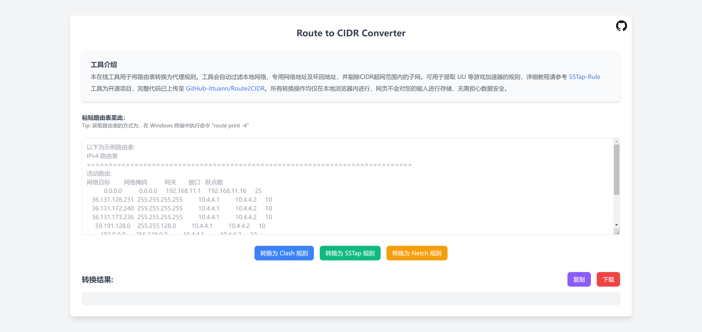

# [Route to CIDR Converter](https://ittuann.github.io/Route2CIDR/)

访问本工具：**_<https://ittuann.github.io/Route2CIDR/>_**

本项目是一个在线工具，用于将路由表转换为 CIDR (无类域间路由，Classless Inter-Domain Routing)，并支持转换为Clash、SSTap和Netch代理规则。

工具会自动过滤本地网络、专用网络、保留地址以及环回地址，并剔除CID超网范围内的子网。

可用于提取 UU 等游戏加速器的规则，详细教程请参考 [SSTap-Rule](https://github.com/FQrabbit/SSTap-Rule/blob/master/doc/UU-extract.md)
